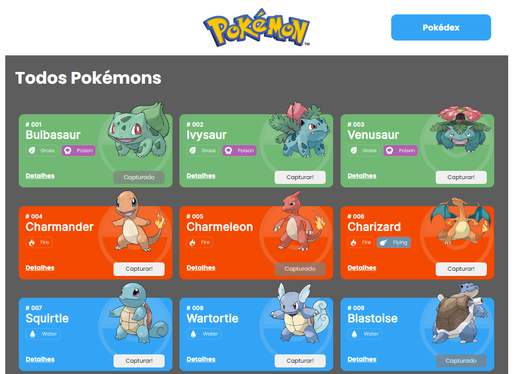
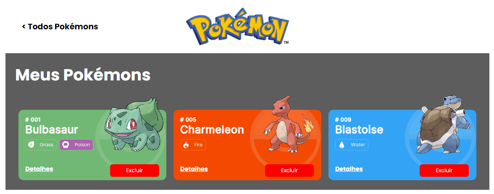
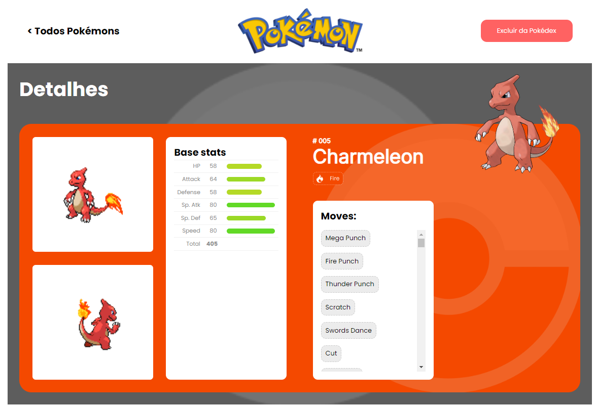

<h1 align="center">Projeto Pokedex</h1>

<div align="center">


</div>

<p align="center"><strong>Deploy: </strong> <a href="https://wylchayer.github.io/projeto-react-apis/">https://wylchayer.github.io/projeto-react-apis/</a> </p>
<br>
<p align="center">
<span><strong>Tecnologias utilizadas:</strong></span>
<br>
  <a href="https://skillicons.dev">
    
  </a>
</p>

## Índice

- [1. Resumo do Projeto](#1-resumo-do-projeto)
- [2. Definição do Projeto](#2-definição-do-projeto)
- [3. Instalações](#3-instalações)
- [4. Iniciando](#4-iniciando)
- [5. Tecnologias utilizadas](#5-tecnologias-utilizadas)
- [6. Lista de Requisitos do Projeto](#6-lista-de-requisitos-do-projeto)
- [7. Desenvolvedor](#6-desenvolvedor)

---

## 1. Resumo do Projeto

A **Pokedex** foi o último projeto do módulo de front-end _bootcamp da Labenu_. O principal objetivo era desenvolver uma plataforma que fosse possível capturar e excluir os pokemons, utilizando os seguintes conteúdos:

- integração com a [_pokeapi_](https://pokeapi.co/);
- custom hooks;
- react router;
- estado global;

Com esses conteúdos foi desenvolvido a [**Pokedex**](https://github.com/wylchayer/projeto-react-apis/).

---

## 2. Definição do Projeto

A [**Pokedex**](https://github.com/wylchayer/projeto-react-apis/) é uma plataforma utilizada para capturar, excluir e ver detalhes dos Pokemons, utilizando a [_pokeapi_](https://pokeapi.co/).

A página inicial apresenta aos usuários os pokemons, mostrando o nome e algumas informações básicas. Nesta tela é possível, em cada cartão, capturar o pokemon e/ou ver os detalhes deste.

<p align="center"></p>

Ao clicar em capturar o pokemon, é informado que ele foi capturado e é transferido para a página da Pokedex, onde consta todos os pokemons capturados e também é possível excluí-los da pokedex.

<p align="center"></p>

Em qualquer página que apresente um card de pokemon, é possível clicar em detalhes e, assim, será apresentada uma nova página mostrando mais detalhes desse pokemon, como as estatísticas básicas e os golpes.

<p align="center"></p>

---

## 3. Instalações

### Pré-requisitos:

- node.js
- npm

---

## 4. Iniciando

- Para instalar as dependências no diretório do seu projeto execute:

```
npm install
```

- Para iniciar o aplicativo execute:

```
npm run dev
```

---

## 5. Tecnologias utilizadas

Esse programa foi construído com:

- JavaScript
- React
- Styled-Components

---

## 6. Lista de Requisitos do Projeto

- **Gerais**
  - ✅ O site deve ter 3 páginas: Home, Pokedex e Detalhes;
  - ✅ Projeto deve seguir o [design](https://www.figma.com/file/KseyA2Ofghiek2Cy3ZaDre/Poked%C3%A9x?t=AEi3zEmWmarf1FbP-0 "design") proposto;
  - ✅ O fluxo de trocas de páginas devem ser semelhante ao [fluxograma](https://www.figma.com/proto/KseyA2Ofghiek2Cy3ZaDre/Poked%C3%A9x?page-id=0%3A1&node-id=2%3A2&viewport=358%2C197%2C0.27&scaling=scale-down&starting-point-node-id=2%3A2 "fluxograma");
- **Página Home:**
  - ✅ Mostrar uma lista de Pokemons, contendo ao menos 20 Pokemons;
  - ✅ Cada Pokemon será representado por um Card;
  - ✅ Em cada card de Pokemon tem um botão para adicioná-lo à Pokedex e um outro botão para acessar os detalhes do Pokemon;
  - ✅ Header dessa página terá um botão para acessar a página da Pokedex
- **Página Pokédex**
  - ✅ Renderizar a lista de pokémons adicionados na pokedex;
  - ✅ Em cada card de Pokemon deve ter um botão para removê-lo da Pokedex e um outro botão para acessar os detalhes do Pokemon.
  - ✅ Header deve ter um botão para voltar para a Home
  - ✅ Não deve ser possível adicionar o mesmo Pokemon duas vezes na Pokedex
- **Página de Detalhes**
  - ✅ Mostrar os detalhes do Pokemon selecionado, com informações descritas
  - ✅ Header deve ter um botão para adicionar ou remover da Pokedex e outro para voltar a página home.

---

## 7. Desenvolvedor

Este projeto foi desenvolvido por:

- **Wylchayer Cruz** : [Linkedin](https://www.linkedin.com/in/wylchayer-cruz/) | [GitHub](https://github.com/wylchayer)
